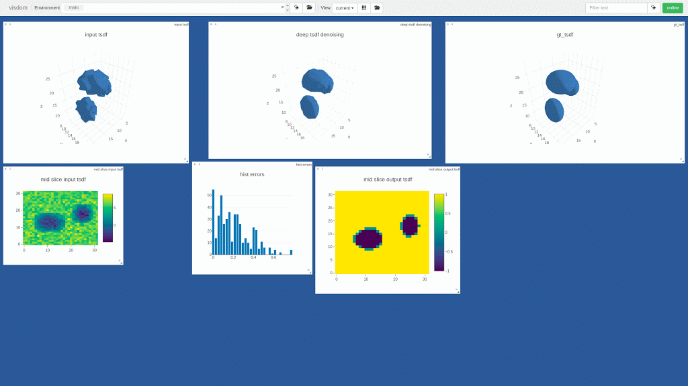
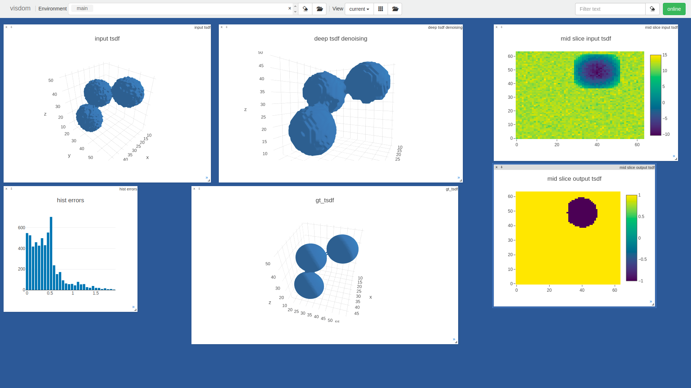

# OctSceneScan

Welcome to my side project for 3D Scene handling. Recently 3D conv have been dominating many tasks such as medical imaging and 3D object classification. However, this are generally very limited in input dimensions because the data grows to the 3rd power with resolution. Scan Complete [] handles this by creating 8 different nets for 3 levels (24 total) where each is trained separately. This causes the net to be very big and does not permit end to end training. 

There are a few papers that handle this using the sparsity in 3D such as octnet[]. Genereally these require knowledge of the sparsity in advance (example 3D point classification) and is not computed on the fly as is needed for signed distance function completion where the location of the level set is not known in advance (it’s the target of the net)
Malik[] used dynamic computation on graphs (in Torch) for 3D object generation from images. This work is my exploration, trying to use PyTorch's simple dynamic graphs to denoise/ complete SDF efficiently.

## Hyrarchal architecture
each level l

TSDF - @full resolution converting 2^-l of the entire scene (in each dimension). Join with previous feature block (if exists) and compute the termination criteria with is a prediction whether the scene surface intersects this block. if yes, the call next level 2^3 times for each sub-block. If this is the finest level, then just compute the full res prediction

Example. Assume input TSDF is 512 (for simplicity input is always a power of 2). and we use feature embedding of D = 128

level 0 - called once with TSDF Block size 512^3.  
  downsample TSDF to 32^2 and processed to create feature block F sized Dx32x32x32
	 slice TSDF and F into 8 , indexed x,y,z in {0,1}^3
	 for x,y,z :
		  output(x,y,z) <- level i+1 with TSDF(x,y,z) and F(x,y,z) - sized 216^3 and 16^3
  return output

level i: called up to 2^3^i time with TSDF block size (512/2^i)^3 and F size DX16^3
  Down sample input TSDF to 32^3 and join with F and predict P(Inside, Outside, Surface) 
	 if P(Surface) < some thresh:
		  return ones_like(TSDF) * argmax(P)
   else:
		  slice TSDF and F into 8 , indexed x,y,z in {0,1}^3
		  for x,y,z :
      output(x,y,z) <- level i+1 with TSDF(x,y,z) and F(x,y,z)
		  return output

If i is the last level, the input TSDF should already be 32^3 and and we should not call the next level. Instead the prediction block is a simple 3D convnet that should output the surface prediction at the input TSDF resolution: 3x32^3

## Hello World
As a hello world I generate a TSDF from random ellipsoids in a 32^3 grid and add gaussian noise. This is small enough to run a full 3D conv net (no hyrarchy, no dynamic branching…)

## Two levels
Generate a TSDF from random ellipsoids in a 64^3 grid and add gaussian noise. This is the limit of what can be run brute force  on a single GPU (no early branch termination, no prediction yet)

## Known Issues
Zero pad is not good for boundaries on the lowest level. Use voxel overlap (currently use replication padding)  
Outpud is not smooth around block edges. Using splits with outverlap should solve this  
Use the prediction in the loss function (otherwise the net will always prefer to go the whole depth)  
Training - Should train layer by layer or depth first with subsampling to handle the large compute untill the prediction converges  
output is blocky. Since output is a classification with dont get the sub-voxel accuracy that could be achieved (see GT ellipsoids)  

## References
author = {Wang, Peng-shuai and Wang, Peng-Shuai and Liu, Yang and Guo, Yu-Xiao and Sun, Chun-Yu and Tong, Xin},  
title = {{O-CNN: Octree-based Convolutional Neural Networks for 3D Shape Analysis}},  
  
author = {Riegler, Gernot and {Osman Ulusoy}, Ali and Geiger, Andreas},  
title = {{OctNet: Learning Deep 3D Representations at High Resolutions}},  
  
author = {Dai, Angela and Ritchie, Daniel and Bokeloh, Martin and Reed, Scott and Sturm, J{\"{u}}rgen and Nie{\ss}ner, Matthias},  
title = {{ScanComplete: Large-Scale Scene Completion and Semantic Segmentation for 3D Scans}}  
  
author = {H{\"{a}}ne, Christian and Tulsiani, Shubham and Malik, Jitendra},  
title = {{Hierarchical Surface Prediction for 3D Object Reconstruction}}  
  
author = {Facebook, Benjamin Graham and Research, Ai and Engelcke, Martin and {Van Der Maaten}, Laurens},  
title = {{3D Semantic Segmentation with Submanifold Sparse Convolutional Networks}}  
  

